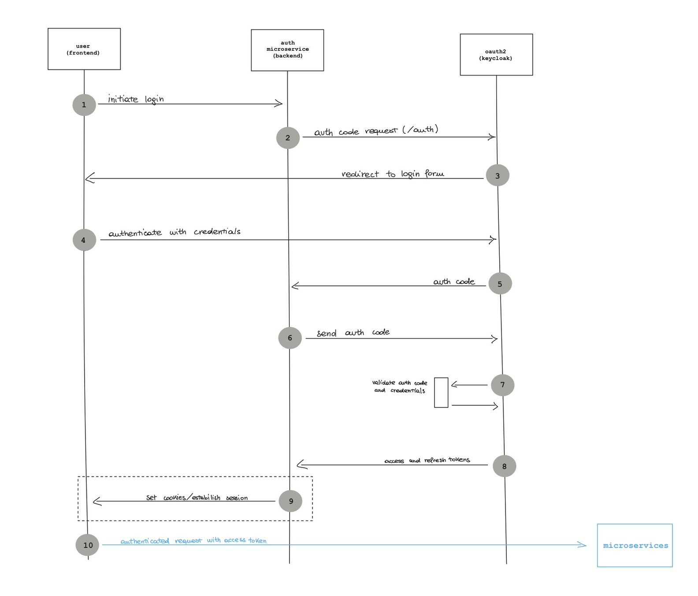
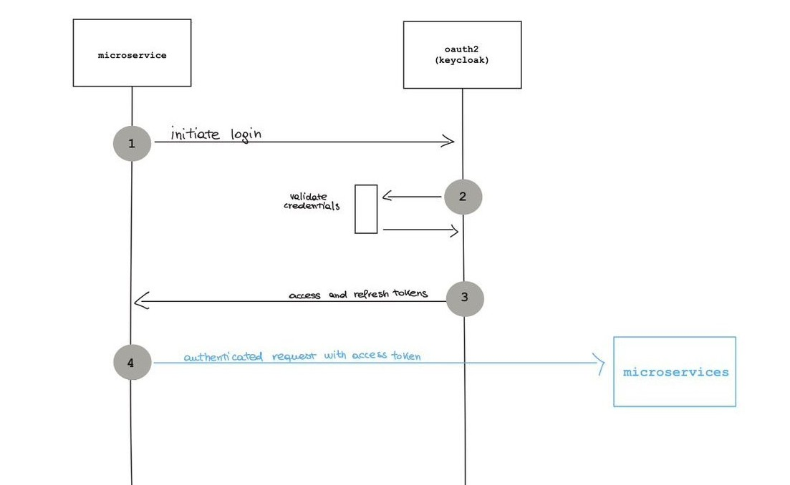
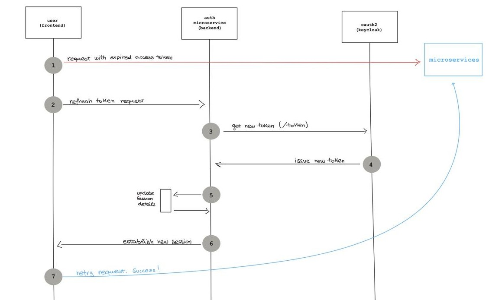

# OAuth2 

## The nuts and bolts of OAuth2

OAuth2 protects resources through standardized authentication and authorization flows managed by an Identity Provider (IDP).

The two main flows used in this project are:
- Authorization Code Flow
- Service Account Flow

The Authorization Code Flow is typically used by:
- web applications
- mobile applications
- user-driven systems

The Service Account Flow is instead used by:
- backend services
- automated applications
- microservices communicating with each other

Both flows provide two fundamental elements:
- an access token
- a refresh token

---

## Access Token

The access token is used to perform authenticated requests towards protected resources and microservices.

Characteristics:
- short-lived
- used as proof of authentication
- grants access to protected APIs

Access tokens should have a short TTL because leaked or stolen tokens may allow unauthorized access to the system.

An access token can be:
- Opaque → random non-readable string
- JWT → signed token containing encoded information

This project uses JWT access tokens.

---

## Refresh Token

The refresh token is used to obtain new access tokens after expiration.

Characteristics:
- longer-lived than access tokens
- used only to refresh authentication
- must be stored securely

When refresh tokens expire, the user must authenticate again.

---

## Authorization Code Flow

In this project we will use the basic version of the flow, without PKCE, for simplicity.



The flow works as follows:

1. The user clicks on a login button or accesses a login endpoint.

2. The backend initiates an authorization request towards the OAuth2 server.

3. The user is redirected to the login page.

4. The user authenticates with valid credentials.

5. Once authentication succeeds, the OAuth2 server generates an authorization code.

6. The authorization code is sent back to the backend through the configured redirect URI.

7. The backend exchanges the authorization code for:
    - an access token
    - a refresh token

8. The OAuth2 server validates:
    - the authorization code
    - the client credentials

9. If validation succeeds, the tokens are issued.

10. The frontend can now perform authenticated requests towards protected microservices.

---

## Why the Authorization Code is Important

The authorization code is a temporary credential used to securely obtain tokens.

This mechanism improves security because:
- the frontend never directly handles user credentials;
- the frontend never directly communicates with the OAuth2 server to obtain tokens;
- token requests are delegated to the backend.

Without the authorization code mechanism, intercepted credentials or tokens could allow attackers to hijack the authentication session and impersonate users.

The OAuth2 server is configured to trust only specific backend clients, reducing the attack surface and improving security.

---

## Service Account Flow

The Service Account Flow is used by non-user-driven applications, such as:
- microservices,
- aggregators,
- notification services,
- automated backend systems.

In this flow there is no interactive user authentication.



The flow works as follows:

1. The microservice owns pre-generated credentials:
    - `client_id`
    - `client_secret`

2. The microservice sends a token request to the OAuth2 server.

3. The OAuth2 server validates the credentials.

4. If validation succeeds, the OAuth2 server returns:
    - an access token
    - optionally a refresh token

5. The microservice can now perform authenticated requests towards other protected microservices.

---

## Characteristics

Compared to the Authorization Code Flow, the Service Account Flow is:
- shorter,
- simpler,
- fully backend-driven.

This is possible because stronger trust assumptions can be made about backend services compared to frontend applications or browsers.

However, service credentials must still be:
- securely stored,
- periodically rotated,
- protected from leaks and unauthorized access.

---

## Access Token Usage

Once an access token is obtained, it can be used to perform authenticated requests towards protected APIs and microservices.

It is the responsibility of each microservice to verify the validity of the received token.

In this project we will use JWT access tokens.

A JWT (JSON Web Token):
- is a cryptographically signed token,
- contains encoded JSON information,
- can be verified without directly contacting the OAuth2 server.

For simplicity, we will not delve into the cryptographic details of JWT generation and signing at this stage.

The signing process works as follows:

- the OAuth2 server signs tokens using a private key;
- microservices receive the corresponding public key;
- microservices validate tokens locally using the public key.

This approach allows token verification to happen completely offline, avoiding continuous communication with the OAuth2 server for every authenticated request.

---

## Refresh Token Usage

Access tokens are short-lived and eventually expire.

When a token expires, token validation fails and authenticated requests are rejected.

To avoid forcing users to authenticate again every time an access token expires, OAuth2 introduces refresh tokens.



The refresh process works as follows:

1. The client detects that the access token has expired.

2. The backend sends a request to the OAuth2 server refresh endpoint.

3. The request contains:
    - the refresh token,
    - the client credentials.

4. If validation succeeds, the OAuth2 server issues:
    - a new access token,
    - optionally a new refresh token.

The refresh process happens entirely on the backend side for security reasons, preventing frontend applications from directly handling sensitive authentication operations.

---

## Appendix — Refreshing Access Tokens

Access tokens are intentionally short-lived.

Once an access token expires, authenticated requests towards protected APIs will fail, typically returning a `401 Unauthorized` response.

To avoid forcing users to authenticate again every time an access token expires, OAuth2 introduces refresh tokens.

Refresh tokens are longer-lived credentials used to request new access tokens from the OAuth2 server.

Compared to access tokens:
- access tokens are short-lived and grant access to protected resources;
- refresh tokens are longer-lived and are only used to obtain new access tokens.

Because refresh tokens can be reused multiple times during a session, they must be securely stored and carefully handled.

When the refresh token itself expires, the user must authenticate again.

---

## Refresh Token Flow

Refreshing an access token is performed through a request to the OAuth2 server token endpoint.

The process works as follows:

1. The client detects that the access token has expired.

2. The backend sends a `POST` request to the token endpoint.

3. The request contains:
    - the `client_id`,
    - the `client_secret`,
    - the `refresh_token`,
    - the `grant_type`.

4. The OAuth2 server validates:
    - the refresh token,
    - the client credentials.

5. If validation succeeds, a new access token is issued.

---

## Example Request

```json
{
    "client_id": "your client id",
    "client_secret": "your client secret",
    "refresh_token": "eyJhbGciOiJIUzUxMiIsInR5cCIgOiAiSldUIiwia2lkIiA6ICI1NDVkNzUyNC1hMzg1LTRiOWItYjRhNy03ZTYwNDczYmU5YTIifQ...",
    "grant_type": "refresh_token"
}
```

The `grant_type` parameter specifies which OAuth2 flow is being used.

In this case:

```text
grant_type = refresh_token
```

Unlike the Authorization Code Flow, which uses:

```text
grant_type = authorization_code
```

The refresh token mechanism allows applications to maintain authenticated sessions without continuously requesting user credentials.