# Keycloak and OAuth2 Demo

## Keycloak

In the previous chapter we introduced the theoretical foundations of OAuth2, its authentication flows, and the concepts of access and refresh tokens.

We will now put these concepts into practice using Keycloak.

Keycloak is an OAuth2-compliant Identity Provider (IDP) developed and maintained by RedHat. It provides authentication and authorization functionalities and can be self-hosted inside distributed systems and microservice architectures.

For simplicity and reproducibility, we will run Keycloak through Docker and Docker Compose and use it to simulate real OAuth2 authentication flows.

## Starting Up

To start a basic Keycloak instance we can use the following `compose.yml` file:

```yaml
  keycloak:
    build:
      context: .
      dockerfile: ./keycloak/Dockerfile 
      network: host 
    entrypoint: ["/opt/keycloak/bin/kc.sh", "start-dev"] 
    environment: #variabili di configurazione
      - KC_HOSTNAME=localhost #192.168.1.108
      - KC_HOSTNAME_PORT=7777
      - KC_HOSTNAME_STRICT=false
      - KC_HOSTNAME_STRICT_HTTPS=false
      - KEYCLOAK_ADMIN=admin
      - KEYCLOAK_ADMIN_PASSWORD=admin
    ports:
      - 7777:8080
```
In general this code: defines a service called keycloak, build the Docker image, starts Keycloak in development mode, exposes the service on port 7777. 
Keycloak requires a Dockerfile because it needs to generate a private/public keypair for cryptographic operations.

Docker file:
```Dockerfile
FROM quay.io/keycloak/keycloak:latest as builder

# Enable health and metrics support
ENV KC_HEALTH_ENABLED=true
ENV KC_METRICS_ENABLED=true

WORKDIR /opt/keycloak

# for demonstration purposes only
RUN keytool -genkeypair -storepass password -storetype PKCS12 -keyalg RSA -keysize 2048 -dname "CN=server" -alias server -ext "SAN:c=DNS:localhost,IP:127.0.0.1" -keystore conf/server.keystore

RUN /opt/keycloak/bin/kc.sh build

FROM quay.io/keycloak/keycloak:latest
COPY --from=builder /opt/keycloak/ /opt/keycloak/
```

Everything is now ready and the container can be started with:

```bash
docker compose up
```

This setup is intentionally simplified and is not production ready. In particular, Keycloak uses an in-memory database and development configuration options.

---

## Realms

Once the container is running, navigate to:

```text
http://localhost:7777
```

and login using the default credentials:

```text
username: admin
password: admin
```

The Keycloak home page should look similar to the following image:

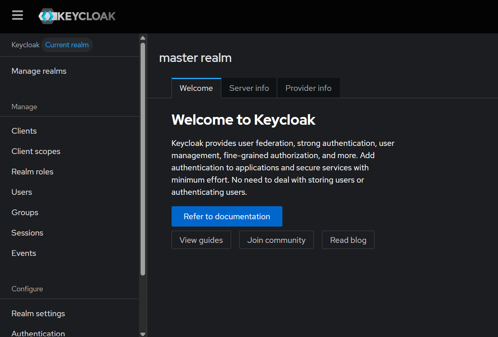

Keycloak introduces the concept of realms as a way to namespace configurations, applications, and users.

A realm can be considered a tenant, meaning an isolated space where authentication and authorization information is managed independently from other realms.

For example, staging and production environments should typically use different realms in order to keep configurations and users separated.

Keycloak creates a default `master` realm used for administration purposes. This realm should not be used for production applications.

To create a new realm:
1. click on the top-left dropdown menu;
2. select `Menage Realms`,
3. and select `Create Realm`.

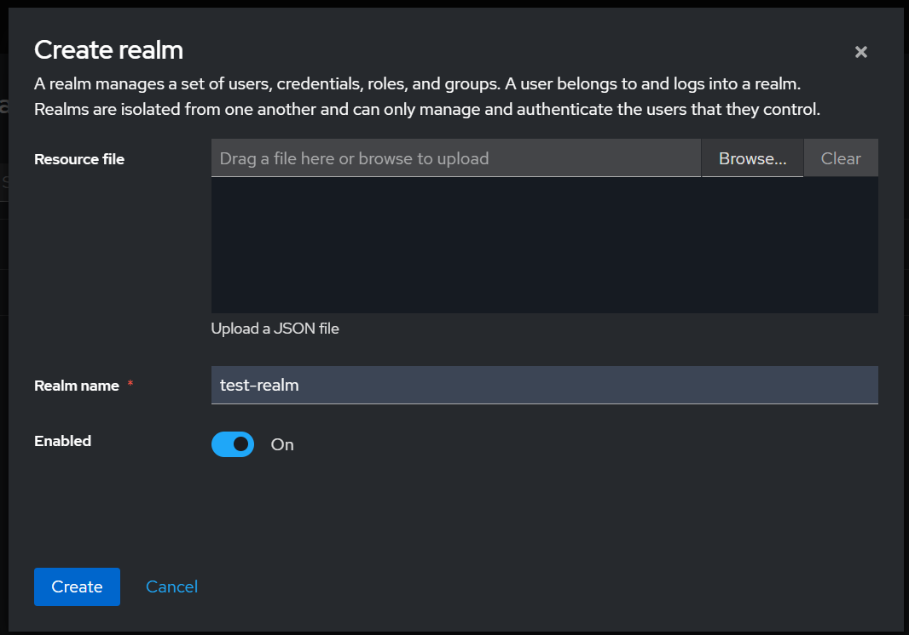

Insert the realm name and proceed.

---

## Clients

Applications interact with Keycloak through OAuth2 clients.

Keycloak defines two types of clients:
- confidential clients
- public clients

Confidential clients are backend applications capable of securely storing credentials such as:
- `client_id`
- `client_secret`

Public clients are applications running directly in browsers or mobile devices.

In most architectures, public clients rely on confidential backend services to perform authentication flows securely.

---

## Creating a Confidential Client in Keycloak

From the left-side menu, select:

```text
Clients
```

The interface should look similar to the following image:

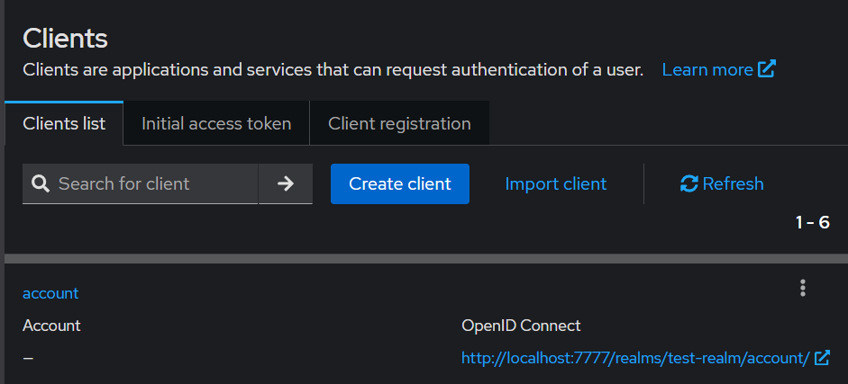

Click on `Create Client`.

Insert the desired `client_id` and continue.

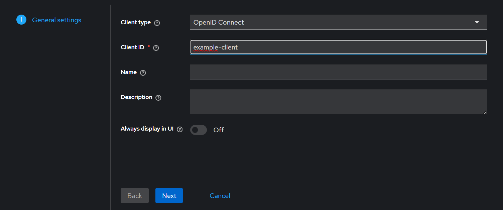

The next step is selecting which OAuth2 flows the client will support.

The most common options are:
- Standard Flow
- Service Accounts Roles

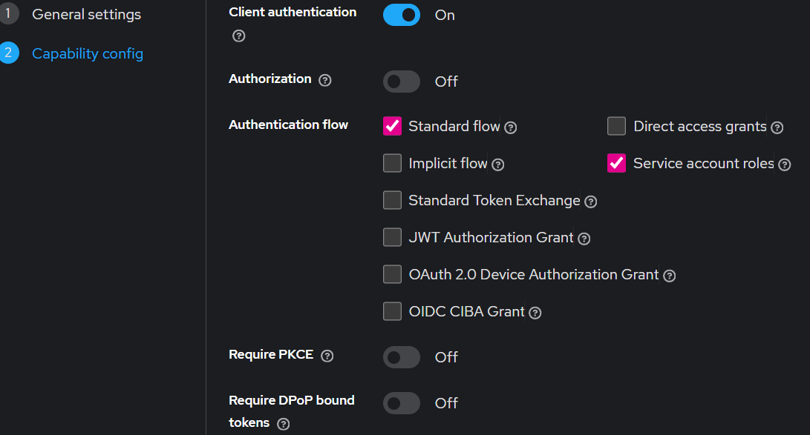

Enabling `Client authentication` makes the client confidential, which allows secure backend authentication using a client secret.

---

## Redirect URIs

The login settings screen defines the URLs used during OAuth2 authentication flows.

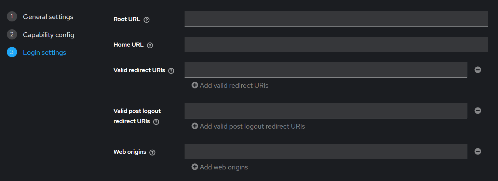

The most important field is:

- Valid Redirect URIs

Redirect URIs represent the backend endpoints that receive the authorization code after a successful authentication.

During the Authorization Code Flow, once the user successfully authenticates, Keycloak redirects the user to one of these configured endpoints together with the generated authorization code.


For this demonstration we do not yet have a real backend application, therefore any placeholder URI can be used.

For example:

```text
http://test.whatever
```
---

## OpenID Endpoint Configuration

From the left-side menu select:

```text
Realm Settings
```

and then:

```text
OpenID Endpoint Configuration
```

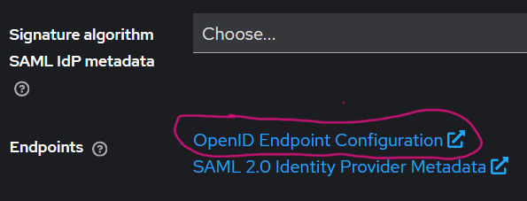

A JSON document containing all OpenID and OAuth2 endpoints will appear.

Two particularly important endpoints are:
- `authorization_endpoint`
- `token_endpoint`

The `authorization_endpoint` is used to start the login flow.

The `token_endpoint` is used to exchange authorization codes for tokens.

---
## Creating a Test User

Before simulating the Authorization Code Flow, we need a user inside the realm.

From the left-side menu select:

```text
Users
```

and click on:

```text
Create new user
```

Insert a username and create the user.

Once the user is created, navigate to the `Credentials` tab and set a password.

Disable the `Temporary` option and confirm the password creation.

The user can now authenticate through the Keycloak login page.
## Simulating the Authorization Code Flow

To start the login flow, copy the `authorization_endpoint` and add at the end:
```text
?response_type=code&client_id=example-client
```

Example:

```text
http://localhost:8080/realms/test-realm/protocol/openid-connect/auth?response_type=code&client_id=example-client
```

Open the URL inside an incognito browser window.

The login page should appear as follows:

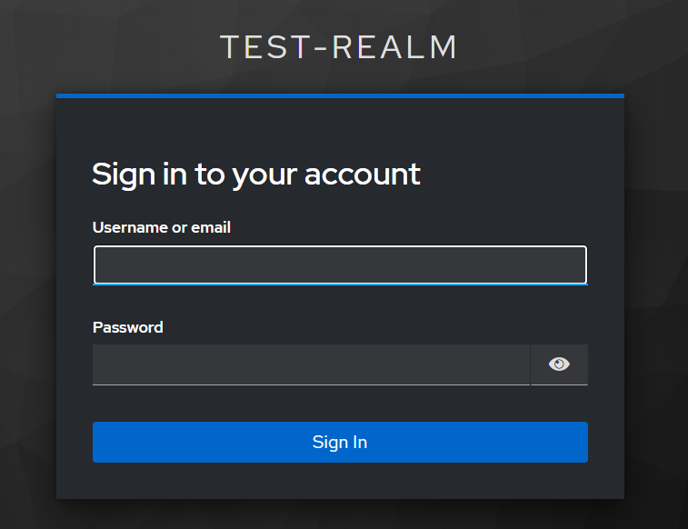

Authenticate using the previously configured credentials.

After a successful login, Keycloak redirects the browser to the configured redirect URI.

The redirected URL will contain several query parameters, including:
- `session_state`
- `iss`
- `code`

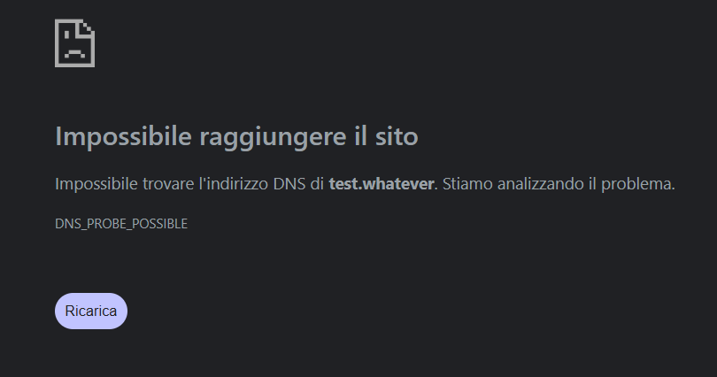

The `code` parameter is the authorization code generated during the OAuth2 flow.

This authorization code can now be exchanged for tokens through the `token_endpoint`.

---

## Retrieving Tokens with Postman

To retrieve tokens, a `POST` request must be sent to the `token_endpoint`.

The request body should contain:
- `client_id`
- `client_secret`
- `grant_type`
- `code`

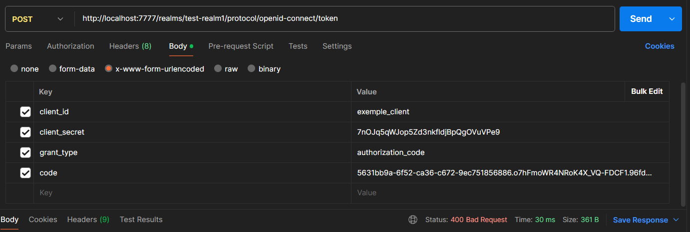

The `grant_type` used in this flow is:

```text
authorization_code
```

Once the request is sent, Keycloak returns:
- an access token
- a refresh token

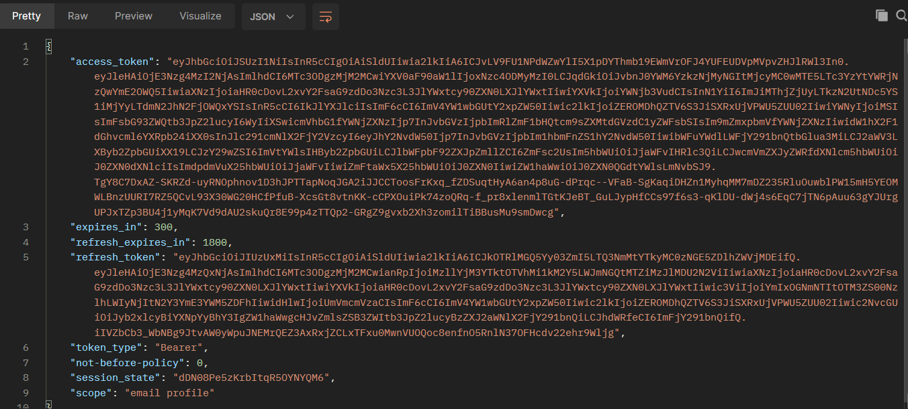

The `access_token` is the credential that will be attached to authenticated requests towards protected microservices.

The `refresh_token` can instead be used to obtain new access tokens once the current one expires, without requiring the user to authenticate again.

The Authorization Code Flow is now complete and authenticated requests can be performed towards protected microservices.