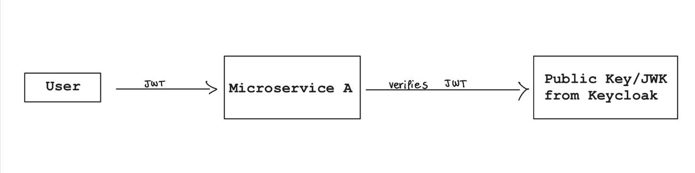
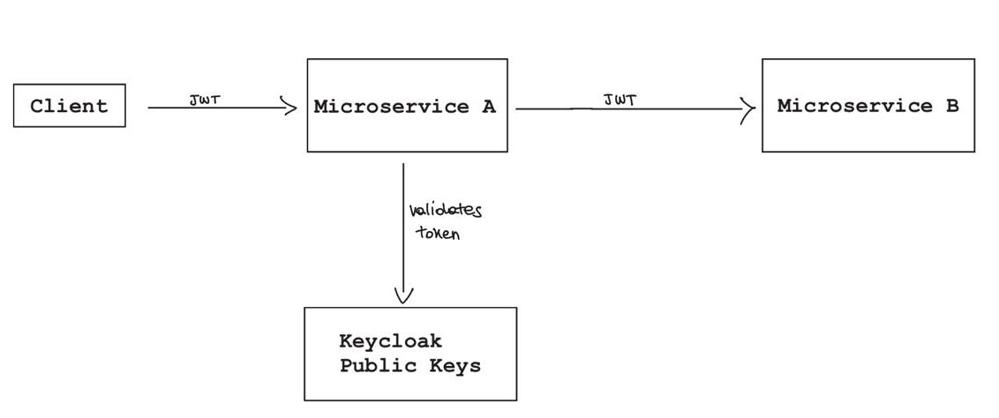

# Protecting Microservices with JWT Validation

## Introduction

In the previous chapters we introduced the theoretical foundations of OAuth2 and simulated the Authorization Code Flow using Keycloak.

We can now move to the next step: protecting microservices and validating authenticated requests inside a distributed system.

Once a client successfully authenticates through the Identity Provider, every request sent to protected APIs will contain an access token. At this stage, microservices become responsible for verifying the validity of such tokens before processing requests.

This introduces one of the key advantages of JWT-based authentication systems in distributed architectures: authentication can be performed in a decentralized way, without continuously contacting the Identity Provider.

---

## JWT Validation in Distributed Systems

As already discussed in Chapter I, JWTs are cryptographically signed tokens that encode information in JSON format.

A JWT is generally composed of three sections separated by dots:

```text
HEADER.PAYLOAD.SIGNATURE
```

The payload contains claims associated with the authenticated user, while the signature guarantees the integrity and authenticity of the token.

Unlike traditional session-based authentication systems, JWT authentication is stateless. This means that microservices do not need to maintain session information inside a centralized database in order to authenticate requests.

Instead, once a request reaches a protected microservice:
- the token is extracted from the `Authorization` header;
- the token signature is verified;
- claims such as expiration time and issuer are validated;
- if all checks succeed, the request is considered authenticated.

This approach is particularly important in microservice architectures because requests are continuously exchanged between independent services. Relying on centralized session lookups for every request would introduce unnecessary coupling and performance bottlenecks.

OAuth2 providers such as Keycloak solve this problem by signing tokens using a private key and exposing the corresponding public key to interested services.

This mechanism allows microservices to verify JWT signatures locally, without contacting the Identity Provider every time a request is received.

In practice:
- Keycloak signs tokens using its private key;
- microservices retrieve the corresponding public key;
- JWT verification happens locally inside each service.

This creates a distributed and scalable authentication layer suitable for modern microservice architectures.


## Spring Security as a Resource Server

Validating JWTs manually inside every endpoint would quickly become difficult to maintain and error-prone.

For this reason, modern Java microservices commonly rely on Spring Security's OAuth2 Resource Server support.

A resource server is a service capable of:
- extracting JWTs from incoming requests;
- validating token signatures;
- checking claims such as expiration time and issuer;
- rejecting unauthorized requests automatically.

In practice, once configured correctly, Spring Security intercepts incoming requests before they reach application controllers.

If the token is:
- missing;
- malformed;
- expired;
- signed by an unknown authority;

the request is automatically rejected with a `401 Unauthorized` response.

This mechanism allows developers to externalize authentication concerns from business logic, greatly simplifying microservice implementations.

A minimal Spring Boot configuration usually looks like the following:

```yaml
spring:
  security:
    oauth2:
      resourceserver:
        jwt:
          issuer-uri: http://keycloak:8080/realms/test-realm
```

The `issuer-uri` property tells Spring Security which Identity Provider generated the tokens.

When the application starts:
- Spring Security contacts the OAuth2 server;
- retrieves the public keys exposed by the provider;
- configures JWT signature validation automatically.

This process generally relies on a JWKS (JSON Web Key Set) endpoint exposed by the Identity Provider.

The important aspect is that, after the initial retrieval of the public keys, token validation happens locally inside the microservice itself.

This means that:
- requests do not require continuous communication with Keycloak;
- authentication remains decentralized;
- the system scales much more efficiently under heavy traffic.

From this point onward, every request reaching the microservice must provide a valid JWT access token inside the `Authorization` header:

```http
Authorization: Bearer eyJhbGciOi...
```

Otherwise, Spring Security will deny access before the request reaches the application layer.

## Propagating Authentication Between Microservices

In microservice architectures, requests rarely terminate inside a single service.

A client request often traverses multiple independent services before a final response is produced. For example:
- an aggregator service may contact multiple downstream services;
- a reporting service may query other APIs;
- an orchestration layer may compose data coming from different microservices.

Because of this, authentication information must propagate across service boundaries.

Consider the following scenario:
- a user authenticates through Keycloak;
- the client receives an access token;
- the token is attached to a request directed to `Microservice A`;
- `Microservice A` then performs additional requests towards `Microservice B`.

In this situation, the second microservice must still be able to identify the authenticated user associated with the original request.

The most common solution is forwarding the original JWT access token between services using the `Authorization` header.

The flow can be summarized as follows:

```text
Client → Microservice A → Microservice B
          Authorization: Bearer <JWT>
```

This approach allows every service involved in the request chain to independently validate the token and apply authorization policies consistently.

An important advantage of this model is that user identity is preserved across the entire distributed system without relying on centralized session storage.

However, propagating authentication also introduces important architectural considerations:
- downstream services must trust the same Identity Provider;
- every microservice must validate JWT signatures correctly;
- internal communications should happen over secure channels;
- sensitive claims should never be blindly trusted without validation.

In practice, authentication becomes a distributed responsibility shared by all participating services.

This is one of the key differences between monolithic and microservice-based security architectures.


