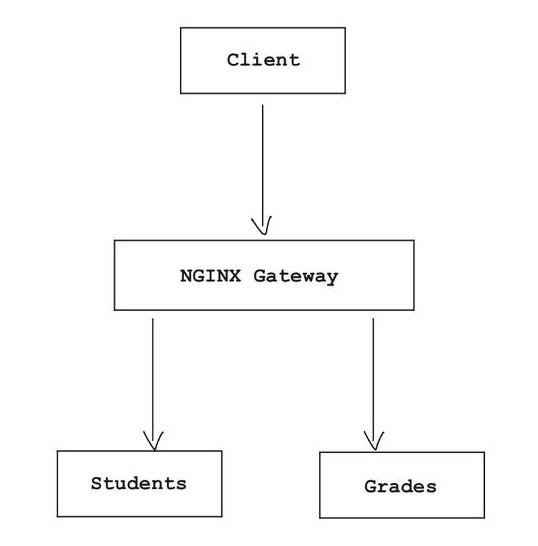
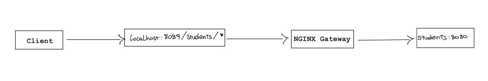

# Centralizing Authorization with NGINX Gateway

## Introduction

In the previous chapter we introduced JWT validation inside individual microservices using Spring Security.

While this approach works correctly, it also introduces an important architectural issue: authentication and authorization logic becomes duplicated across multiple services.

As the number of microservices grows, maintaining the same security configuration inside every application quickly becomes difficult and error-prone.

A common solution to this problem is introducing a centralized gateway layer responsible for:
- routing requests;
- filtering traffic;
- validating authentication information before requests reach backend services.

In this chapter we will use NGINX as an application gateway and implement centralized authorization logic for our distributed system.

## What is an Application Gateway

An application gateway acts as the main entry point to a distributed system.

Instead of exposing every microservice directly to external clients, requests are first intercepted by the gateway, which becomes responsible for forwarding traffic to the correct internal services.

This architectural pattern introduces several advantages:
- centralized request routing;
- traffic filtering;
- simplified security management;
- reduced exposure of internal services;
- improved scalability and maintainability.

In practice, clients no longer communicate directly with backend microservices.

Instead, the request flow becomes:

```text
Client → Gateway → Microservices
```


This allows the gateway to enforce authentication and authorization policies before requests reach the application layer.

In modern microservice architectures, gateways are commonly used to centralize cross-cutting concerns such as:
- authentication;
- authorization;
- rate limiting;
- logging;
- load balancing;
- request tracing.

## NGINX as a Gateway

NGINX is a widely used open-source software commonly adopted as:
- a web server;
- a reverse proxy;
- a load balancer;
- an application gateway.

In our architecture, NGINX will act as the single entry point exposed to external clients.

Instead of directly exposing backend microservices, incoming traffic will first reach the gateway, which will then forward requests internally through the Docker network.

To integrate NGINX inside our environment, we add a new `proxy` service to the `compose.yml` file:

```yaml
proxy:
    image: nginx:mainline
    networks:
        - microservices-net
    volumes:
        - ./nginx/gateway.conf:/etc/nginx/conf.d/gateway.conf
    ports:
        - 8089:14000
    depends_on:
        - students
        - grades
```

This configuration:
- creates a new container running NGINX;
- connects the gateway to the same Docker network as the microservices;
- exposes port `8089` externally;
- mounts the custom gateway configuration file inside the container.

At this stage, external clients will only communicate with the NGINX gateway, while backend services remain isolated inside the internal Docker network.

## Routing Requests to Microservices

NGINX routes traffic using `location` blocks.

Each location defines how incoming requests should be forwarded to backend services.

For example, the following configuration exposes the `students` microservice through the gateway:

```nginx
location /students/ {

    proxy_pass http://students:8080/;
    proxy_http_version 1.1;
    proxy_set_header Host $host;
    proxy_set_header X-Forwarded-For $remote_addr;
}
```

Requests reaching:

```text
http://localhost:8089/students/*
```


are automatically forwarded to the internal `students` container.

The same mechanism can be used for additional services such as the `grades` microservice.

This approach provides an important architectural advantage: backend services are no longer directly exposed outside the Docker network.

As a consequence:
- routing becomes centralized;
- internal services remain isolated;
- gateway-level security policies can be enforced consistently.

## Adding Authorization Logic at the Gateway

Routing requests through a centralized gateway also allows authentication and authorization checks to be performed before requests reach backend services.

To implement this behaviour, the gateway must first extract the JWT access token from incoming requests.

In OAuth2 systems, access tokens are typically attached to requests using the `Authorization` header:

```http
Authorization: Bearer eyJhbGciOi...
```

NGINX allows access to request headers through variables.

The following configuration extracts the Bearer token from the `Authorization` header and stores it inside a reusable variable:

```nginx
map $http_authorization $header_token {
    "~*^Bearer (.*)$" $1;
    default $http_authorization;
}
```

Once extracted, the token can be used by the gateway to apply custom authorization logic before forwarding requests to internal services.

To execute authorization checks, NGINX provides the `auth_request` directive.

The following configuration enables authorization validation for the `grades` microservice:

```nginx
location /grades/ {

    auth_request .validate_token;
    error_page 401 = .unauthorized;
    error_page 403 = .forbidden;

    proxy_pass http://grades:8080/;
}
```

When a request reaches the gateway:
- the JWT token is extracted from the request;
- the `.validate_token` internal route executes custom validation logic;
- invalid requests are rejected immediately;
- valid requests are forwarded to the target microservice.

This architecture introduces an important advantage: unauthorized requests never reach backend services.


As a consequence:
- security policies become centralized;
- duplicated authorization logic is reduced;
- microservices remain smaller and easier to maintain.

## Custom Authorization with NJS

To implement custom authorization logic inside the gateway, we can leverage NGINX's NJS module.

NJS is a lightweight JavaScript runtime integrated into NGINX that allows developers to execute custom logic directly inside the gateway configuration.

In our example, the gateway validates the `email_verified` claim contained inside JWT access tokens.

The custom validation logic is implemented inside the `check_email.js` file:

```javascript
const checkToken = (r) => {

    const access_token = r.variables.header_token;

    const split = access_token.split(".");
    if(split.length < 3){
        r.return(401);
        return;
    }

    const decoded_payload = Buffer.from(split[1], 'base64').toString();

    try{
        const json_payload = JSON.parse(decoded_payload);

        if(json_payload["client_id"] === "aggregator"){
            r.return(204);
            return;
        }

        if(!json_payload["email_verified"]){
            r.return(403);
            return;
        }

        r.return(204);

    }catch(err){
        r.return(401);
    }
}
```

The validation flow is relatively simple:
- the JWT payload is extracted and decoded;
- the gateway checks whether the token contains the `email_verified` claim;
- if the claim is missing or set to `false`, the request is rejected;
- otherwise, the request is allowed to continue.

The `aggregator` service is excluded from this validation because service accounts generally do not contain user email information.

The script is executed through an internal NGINX route:

```nginx
location = .validate_token  {
    internal;
    js_content validator.checkToken;
}
```

When the `auth_request` directive invokes this route:
- `204` means the request is authorized;
- `401` means the token is invalid;
- `403` means the request is authenticated but forbidden.

This mechanism allows the gateway to centralize authorization policies before traffic reaches backend services.


As a consequence, microservices no longer need to duplicate the same authorization checks individually.

## Conclusion

At this stage, authorization logic has been centralized inside the gateway layer.

Instead of duplicating security checks across multiple microservices, requests are now filtered directly by the NGINX gateway before reaching backend services.

This architectural approach improves:
- maintainability;
- scalability;
- consistency of authorization policies;
- separation of concerns inside the distributed system.

In the next chapter we will test the complete architecture by simulating authenticated and unauthorized requests through the NGINX gateway.

