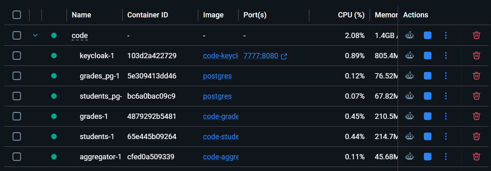
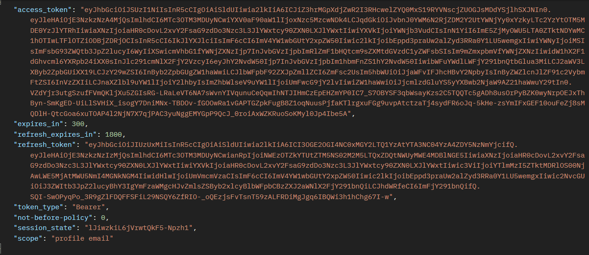

# NGINX Gateway Demo

## Introduction

In the previous chapter we introduced NGINX as a centralized gateway responsible for routing and filtering requests before they reach backend microservices.

We can now test the complete architecture in practice.

In this chapter we will:
- start the gateway-enabled environment;
- authenticate through Keycloak;
- issue requests using Postman;
- observe how the gateway handles valid and invalid requests.

The goal of this demonstration is verifying that authorization logic is correctly enforced before requests reach internal services.

## Starting the Environment

Before testing the gateway, we first need to start the complete environment.

The system now includes:
- Keycloak;
- the `students` microservice;
- the `grades` microservice;
- the `aggregator` service;
- the NGINX gateway.

The updated `compose.yml` file also includes the `proxy` service responsible for routing external traffic through NGINX.
Before starting the containers, the microservices must first be compiled in order to generate the `.jar` artifacts required by the Docker images.

From the `microservices` directory, execute the Gradle build for each service:

```bash
cd students
./gradlew build

cd ../grades
./gradlew build

cd ../aggregator
./gradlew build
```

Once the build process completes, the environment can be started through Docker Compose.
To start the environment, execute:

```bash
docker compose up --build
```

Once all containers are running, the architecture should look similar to the following:



At this stage:
- backend microservices are only reachable internally through the Docker network;
- external requests must pass through the NGINX gateway;
- authorization checks are enforced before requests reach backend services.

The gateway is exposed on port `8089`.

Requests directed to:

```text
http://localhost:8089/students/*
```

or:

```text
http://localhost:8089/grades/*
```

will now be routed through the centralized authorization layer.

## Obtaining an Access Token

Before testing the gateway, we first need to authenticate through Keycloak and retrieve a valid JWT access token.

As discussed in Chapter II, the authentication flow can be completed through the OAuth2 Authorization Code Flow using the Keycloak authorization endpoint.

Once the login procedure completes successfully, the authorization code can be exchanged for an access token through the token endpoint.

A successful response returned by Keycloak looks similar to the following:



The returned `access_token` will now be attached to requests directed to the NGINX gateway.

The gateway will validate the token before forwarding requests to backend microservices.