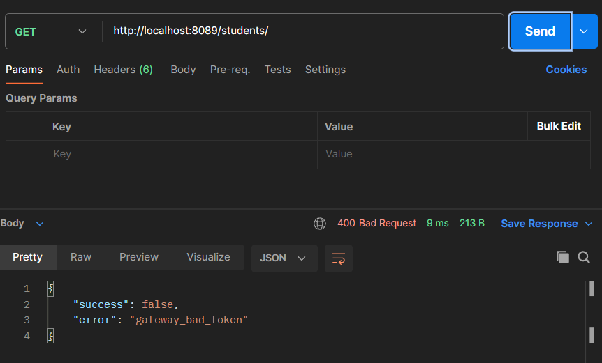
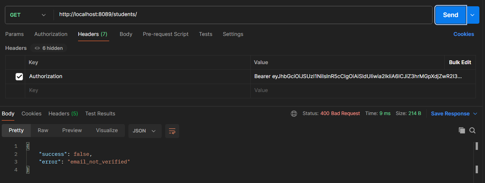
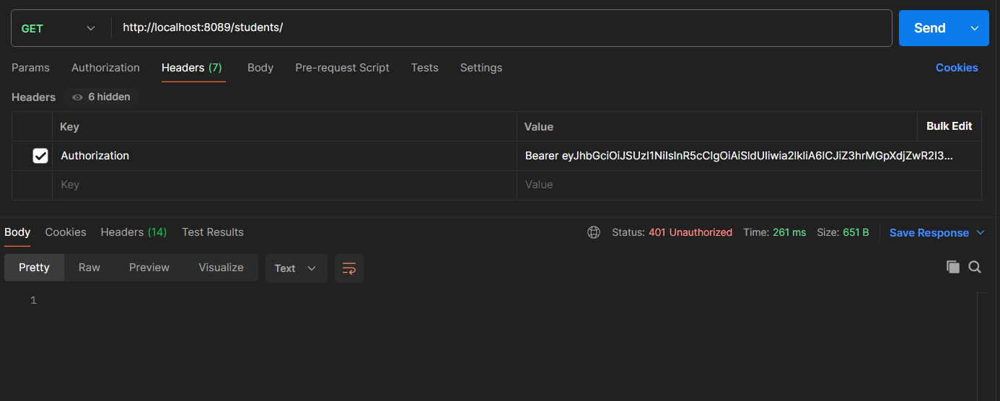

# NGINX Gateway Demo

## Introduction

In the previous chapter we introduced NGINX as a centralized gateway responsible for routing and filtering requests before they reach backend microservices.

We can now test the complete architecture in practice.

In this chapter we will:
- start the gateway-enabled environment;
- authenticate through Keycloak;
- issue requests using Postman;
- observe how the gateway handles valid and invalid requests.

The goal of this demonstration is verifying that authorization logic is correctly enforced before requests reach internal services.

## Starting the Environment

Before testing the gateway, we first need to start the complete environment.

The system now includes:
- Keycloak;
- the `students` microservice;
- the `grades` microservice;
- the `aggregator` service;
- the NGINX gateway.

The updated `compose.yml` file also includes the `proxy` service responsible for routing external traffic through NGINX.
Before starting the containers, the microservices must first be compiled in order to generate the `.jar` artifacts required by the Docker images.

From the `microservices` directory, execute the Gradle build for each service:

```bash
cd students
./gradlew build

cd ../grades
./gradlew build

cd ../aggregator
./gradlew build
```

Once the build process completes, the environment can be started through Docker Compose.
To start the environment, execute:

```bash
docker compose up --build
```

Once all containers are running, the architecture should look similar to the following:


At this stage:
- backend microservices are only reachable internally through the Docker network;
- external requests must pass through the NGINX gateway;
- authorization checks are enforced before requests reach backend services.

The gateway is exposed on port `8089`.

Requests directed to:

```text
http://localhost:8089/students/*
```

or:

```text
http://localhost:8089/grades/*
```

will now be routed through the centralized authorization layer.

## Obtaining an Access Token

Before testing the gateway, we first need to authenticate through Keycloak and retrieve a valid JWT access token.

As discussed in Chapter II, the authentication flow can be completed through the OAuth2 Authorization Code Flow using the Keycloak authorization endpoint.

Once the login procedure completes successfully, the authorization code can be exchanged for an access token through the token endpoint.

A successful response returned by Keycloak looks similar to the following:


The returned `access_token` will now be attached to requests directed to the NGINX gateway.

The gateway will validate the token before forwarding requests to backend microservices.

## Unauthorized Requests

We can now test how the gateway behaves when requests are issued without authentication information.

If a request is sent without an `Authorization` header:

```http
GET http://localhost:8089/students/
```

the gateway immediately blocks the request before forwarding it to backend services.



This demonstrates that unauthenticated traffic is intercepted directly at the gateway layer.

As a consequence:
- backend microservices are never reached;
- unauthorized requests are filtered centrally;
- security policies become independent of application business logic.

## Email Verification Validation

The gateway can also enforce custom authorization policies based on JWT claims.

In our example, the NJS validation logic checks whether the `email_verified` claim is enabled inside the access token.

If a valid token contains:

```text
email_verified = false
```

the request is rejected by the gateway:



This behaviour is implemented through the custom `check_email.js` script introduced in the previous chapter.

Even though the token itself is valid, the centralized authorization layer prevents the request from reaching backend services because the user does not satisfy the required policy.

## Successful Gateway Forwarding

Once the `email_verified` claim is enabled for the authenticated user, the gateway successfully forwards the request to the backend microservice.



At this stage, authorization is no longer rejected by the gateway itself, meaning that the centralized authorization layer validated the request correctly.

The remaining `401 Unauthorized` response is instead generated by the backend application, which still independently validates JWT authenticity through Spring Security.

This demonstrates how:
- authorization policies can be centralized at the gateway layer;
- backend services can still enforce their own authentication mechanisms.

## Authorization Responsibilities

An important aspect of this architecture is understanding the separation of responsibilities between the gateway and backend microservices.

In our implementation, the NGINX gateway is responsible for:
- extracting JWT access tokens;
- applying centralized authorization policies;
- filtering unauthorized requests before they reach backend services.

However, the gateway does not fully replace backend authentication mechanisms.

Microservices still independently validate JWT authenticity through Spring Security and OAuth2 Resource Server support.

This layered approach provides multiple advantages:
- centralized authorization policies;
- decentralized token validation;
- improved modularity;
- better separation of concerns.

In practice:
- the gateway acts as the first security layer;
- backend services remain responsible for validating token authenticity and protecting internal resources.

This model is commonly adopted in modern distributed systems because it combines scalability with flexible security enforcement.

## Conclusion

Throughout this module we explored how modern microservice architectures can implement decentralized authentication and centralized authorization using OAuth2, JWTs, Keycloak and NGINX.

We first introduced the theoretical foundations of OAuth2 and token-based authentication, then configured a practical Keycloak environment to simulate real authentication flows.

Afterwards, we moved to JWT validation inside distributed systems using Spring Security and finally centralized authorization logic inside an NGINX gateway using custom NJS validation scripts.

The final architecture demonstrates how:
- authentication can be delegated to an Identity Provider;
- JWT validation can happen locally inside services;
- authorization policies can be centralized at the gateway layer;
- microservices can remain smaller and more focused on business logic.

This layered approach represents a common and scalable security model for modern distributed systems.
